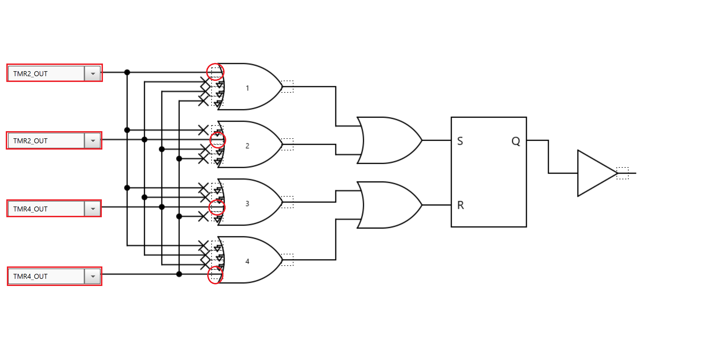
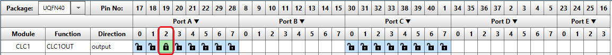
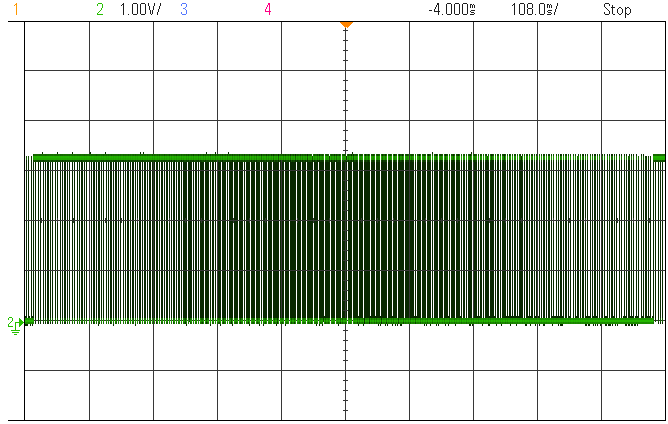

  <article class="markdown-body entry-content p-3 p-md-6" itemprop="text">

# PIC18F47Q10: Getting started with the CLC on PIC18 -> Using the CLC to Create an LED Dimming Effect -> MCC Generated code

## Objective:
The PIC18F47Q10 features 8 Configurable Logic Cell (CLC) peripherals that cen be used to implemenmt various logic functions.
This example shows an initialization of the CLC in the SR Latch mode that enables the implementation of an
automatic fixed frequency with variable duty-cycle PWM signal. The function is called automatic as it does not require
code or core supervision to work, the hardware is set at start-up and can be reconfigured during run-time.

## Resources:
- Technical Brief Link [(linkTBD)](http://www.microchip.com/)
- MPLAB® X IDE 5.30 or newer [(microchip.com/mplab/mplab-x-ide)](http://www.microchip.com/mplab/mplab-x-ide)
- MPLAB® XC8 2.10 or newer compiler [(microchip.com/mplab/compilers)](http://www.microchip.com/mplab/compilers)
- MPLAB® Code Configurator (MCC) 3.95.0 or newer [(microchip.com/mplab/mplab-code-configurator)](https://www.microchip.com/mplab/mplab-code-configurator)
- PIC18F47Q10 Curiosity Nano [(DM182029)](https://www.microchip.com/Developmenttools/ProductDetails/DM182029)
- [PIC18F47Q10 datasheet](http://ww1.microchip.com/downloads/en/DeviceDoc/40002043D.pdf) for more information or specifications.

## Hardware Configuration:

The PIC18F47Q10 Curiosity Nano Development Board [(DM182029)](https://www.microchip.com/Developmenttools/ProductDetails/DM182029) is used as the test platform.

The following configurations must be made for this project:
- Timer 2 frequency = 24.41 Hz (4.096 ms period)
- Timer 4 frequency = 24.51 Hz (4.08 ms period)

CLC Configuration:
- CLC1 is set up as SR Latch

I/O configurations:
- RA2 pin - Configured output 

This setup will create an internal connection as depicted:

## Demo:
Run the code written in Bare metal, the following signals are to be seen on the oscilloscope:

In the figure below  it is depicted the CLC1 output implementing the fixed frequency with variable duty-cycle function:
- Signal 2 (Green) is CLC1 output

